# Arquitetura do Mobile Bridge Skeleton

Este documento explica a arquitetura e os conceitos fundamentais implementados neste skeleton.

## 📐 Visão Geral da Arquitetura


## 🔄 Fluxo de Comunicação

### 1. Web → Native

```javascript
// Web App
const result = await window.WebBridge.send('showNotification', {
  title: 'Hello',
  message: 'World'
});
```


### 2. Native → Web

```typescript
// Native
await MobileBridge.sendToWeb(webViewRef, 'dataUpdate', { data: 'new' });
```


## 🏗️ Componentes Principais

### 1. Mobile Bridge (`src/bridge/MobileBridge.ts`)

**Responsabilidade**: Gerenciar comunicação bidirecional entre Native e Web

**Features**:
- Registro de handlers
- Validação de mensagens
- Sistema de callbacks
- Timeout handling
- Security integration

**API**:
```typescript
// Registrar handler
MobileBridge.registerHandler(type: string, handler: Function);

// Enviar para web
MobileBridge.sendToWeb(webViewRef, type: string, payload: any);

// Processar mensagem
MobileBridge.handleMessage(message: BridgeMessage);
```

### 2. Bridge Security (`src/utils/BridgeSecurity.ts`)

**Responsabilidade**: Garantir segurança na comunicação

**Features**:
- Message validation
- Signature verification
- Timestamp validation (replay attack protection)
- Rate limiting (DDoS protection)
- XSS sanitization
- URL validation

**Camadas de Segurança**:
1. **Structural Validation**: Verifica estrutura da mensagem
2. **Timestamp Validation**: Mensagens expiram em 5 minutos
3. **Signature Verification**: HMAC-based integrity check
4. **Rate Limiting**: Max 100 req/min por tipo
5. **Sanitization**: Escape de caracteres perigosos

### 3. Offline Storage (`src/storage/OfflineStorage.ts`)

**Responsabilidade**: Persistência e cache de dados

**Features**:
- Cache com expiração
- Fila de ações pendentes
- Retry mechanism
- Statistics e monitoring
- Auto-cleanup

**API**:
```typescript
// Cache
await OfflineStorage.cacheData(key, data, expiresIn);
const data = await OfflineStorage.getCachedData(key);

// Queue
await OfflineStorage.queueAction(type, payload);
const pending = await OfflineStorage.getPendingActions();
```

### 4. Network Manager (`src/network/NetworkManager.ts`)

**Responsabilidade**: Monitorar conectividade

**Features**:
- Real-time network detection
- Status listeners
- Connection waiting
- Offline/online events

**Eventos**:
- `onConnected`: Quando conecta
- `onDisconnected`: Quando desconecta

### 5. Sync Manager (`src/sync/SyncManager.ts`)

**Responsabilidade**: Sincronização de dados offline

**Features**:
- Auto-sync quando volta online
- Retry logic com backoff
- Execute with offline support
- Sync callbacks

**Fluxo**:


### 6. Secure Storage (`src/storage/SecureStorage.ts`)

**Responsabilidade**: Armazenamento seguro de dados sensíveis

**Features**:
- Encrypted storage (opcional)
- Fallback para AsyncStorage
- Object serialization

**Uso**:
```typescript
// Simples
await SecureStorage.setItem('token', 'abc123');
const token = await SecureStorage.getItem('token');

// Objetos
await SecureStorage.setObject('user', { id: 1, name: 'John' });
const user = await SecureStorage.getObject('user');
```

## 🔐 Camadas de Segurança


### Layer 1: Transport Security
- HTTPS obrigatório em produção
- Certificate pinning (recomendado)

### Layer 2: Message Security
```typescript
Message = {
  id: unique_id,
  type: 'action',
  payload: data,
  timestamp: now,
  signature: HMAC(SECRET + data + SECRET)
}
```

### Layer 3: Rate Limiting
- Max 100 requests per minute per message type
- Sliding window algorithm

### Layer 4: Validation
1. Check required fields (id, type)
2. Validate timestamp (max 5 min old)
3. Verify signature
4. Check rate limit
5. Execute handler

### Layer 5: Sanitization
- Escape special chars
- Validate URLs
- Prevent XSS
- Prevent injection

## 💾 Offline First Strategy

### Cache-First Pattern


### Queue Pattern


### Cache Invalidation


## 🎯 Padrões de Design

```mermaid
classDiagram
    class NetworkManager {
        -instance: NetworkManager
        +getInstance()
        +addListener()
        +removeListener()
        <<Singleton>>
    }

    class SyncManager {
        -instance: SyncManager
        +getInstance()
        +addSyncCallback()
        <<Singleton>>
    }

    class OfflineStorage {
        -instance: OfflineStorage
        +getInstance()
        +cacheData()
        +queueAction()
        <<Singleton>>
    }

    class SecureStorage {
        +setItem()
        +getItem()
        <<Strategy>>
    }

    class EncryptedStorage {
        +setItem()
        +getItem()
    }

    class AsyncStorage {
        +setItem()
        +getItem()
    }

    class MobileBridge {
        +registerHandler()
        +handleMessage()
        +sendToWeb()
        <<Promise Pattern>>
    }

    SecureStorage --> EncryptedStorage : uses
    SecureStorage --> AsyncStorage : fallback
    NetworkManager --> SyncManager : notifies
    SyncManager --> OfflineStorage : uses

    note for NetworkManager "Observer Pattern: Notifica listeners sobre mudanças de rede"
    note for SecureStorage "Strategy Pattern: Escolhe storage baseado em disponibilidade"
    note for MobileBridge "Promise Pattern: Todas operações são async"
```



### 1. Singleton Pattern
```typescript
// NetworkManager, SyncManager, OfflineStorage são singletons
class Manager {
  private static instance: Manager;
  static getInstance() {
    if (!this.instance) this.instance = new Manager();
    return this.instance;
  }
}
```

### 2. Observer Pattern
```typescript
// Listeners para eventos de rede e sincronização
NetworkManager.addListener((isOnline) => { ... });
SyncManager.addSyncCallback((success, count) => { ... });
```

### 3. Strategy Pattern
```typescript
// Diferentes estratégias de storage
SecureStorage.setItem() // Uses EncryptedStorage or AsyncStorage
```

### 4. Promise Pattern
```typescript
// Todas as operações assíncronas retornam Promises
await MobileBridge.sendToWeb(ref, 'action', data);
```

## 📊 Fluxo de Dados

### Online Flow


### Offline Flow


## 🔄 Lifecycle

### App Initialization


### App Cleanup


## 🧪 Testing Strategy

### Unit Tests
- MobileBridge message handling
- Security validation
- Storage operations
- Network detection

### Integration Tests
- Web ↔ Native communication
- Offline sync flow
- Cache invalidation
- Error handling

### E2E Tests
- Full user flows
- Offline scenarios
- Security edge cases

## 🚀 Performance Optimizations

### 1. Message Batching
```typescript
// Batch multiple messages to reduce overhead
const results = await Promise.all([
  MobileBridge.handleMessage(msg1),
  MobileBridge.handleMessage(msg2)
]);
```

### 2. Lazy Loading
```typescript
// Load WebView only when needed
{isWebViewNeeded && <TurboWebView ... />}
```

### 3. Cache Optimization
```typescript
// Use short TTL for frequently changing data
await OfflineStorage.cacheData('key', data, 60000); // 1 min
```

### 4. Memory Management
```typescript
// Clear old callbacks to prevent leaks
MobileBridge.clear();
```

## 📈 Monitoring & Debugging

### Logs
```typescript
console.log('[Bridge] Message received:', message);
console.log('[Sync] Synced actions:', count);
console.log('[Network] Status changed:', isOnline);
```

### Statistics
```typescript
// Cache stats
const stats = await OfflineStorage.getCacheStats();
console.log('Cache size:', stats.totalSize);

// Queue stats
const queueStats = await OfflineStorage.getQueueStats();
console.log('Pending actions:', queueStats.totalActions);
```

### Error Tracking
```typescript
try {
  await MobileBridge.handleMessage(message);
} catch (error) {
  ErrorLogger.log(error);
}
```

## 🔧 Extensibility

### Adding New Handlers
```typescript
MobileBridge.registerHandler('newAction', async (payload) => {
  // Your logic
  return { success: true, data: result };
});
```

### Custom Storage
```typescript
class CustomStorage extends OfflineStorage {
  // Override methods
}
```

### Custom Security
```typescript
class CustomSecurity extends BridgeSecurity {
  // Add custom validation
}
```

## 🎓 Best Practices

1. **Always validate input**: Never trust data from WebView
2. **Use TypeScript**: Type safety prevents many bugs
3. **Handle errors gracefully**: Never crash the app
4. **Log important events**: Makes debugging easier
5. **Test offline scenarios**: Ensure data integrity
6. **Monitor performance**: Watch memory and CPU usage
7. **Version your APIs**: Add version to messages
8. **Document handlers**: Clear documentation for each handler
9. **Use constants**: Avoid magic strings
10. **Clean up resources**: Always cleanup in useEffect

## 📚 References

- [React Native WebView](https://github.com/react-native-webview/react-native-webview)
- [Offline First](https://offlinefirst.org/)
- [OWASP Mobile Security](https://owasp.org/www-project-mobile-security/)
