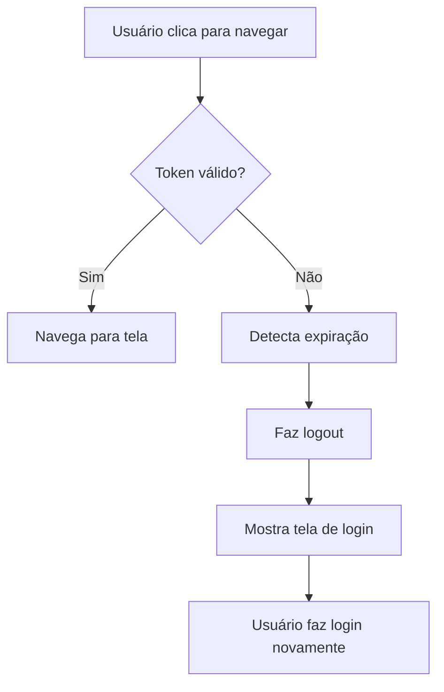

# Teste de Expiração de Token

## Cenário: Tentando abrir WebView com token expirado

### O que foi corrigido

Antes, quando o token expirava e o usuário tentava navegar para a WebView, o app não verificava se o token ainda era válido e simplesmente navegava para a tela (causando problemas).

Agora, **todas as navegações** verificam se o token ainda é válido antes de mudar de tela.

---

## Como Testar

### Teste 1: Token Expira e Usuário Tenta Abrir WebView

#### Passo 1: Fazer Login
1. Abra o app
2. Faça login com:
   - Email: `usuario@teste.com`
   - Senha: `senha123`
3. O token tem duração de **10 segundos**

#### Passo 2: Aguardar Expiração
1. Aguarde **mais de 10 segundos**
2. O token está agora **expirado** (mas o app ainda está autenticado na memória)

#### Passo 3: Tentar Navegar para WebView
1. Clique no botão **"Abrir WebView Embedded"** na tela Home
   - OU clique no ícone 🌐 na bottom navigation
   - OU vá para Profile e clique em "Ver Loja (WebView)"

#### Resultado Esperado ✅
- O app detecta que o token expirou
- Faz logout automático
- Mostra a **tela de login** novamente
- **NÃO abre a WebView**

#### Logs Esperados no Console
```
[App.TestHost] Attempting to navigate to: webview
[App.TestHost] Token expired during navigation - forcing logout
[Auth] Logout successful
[App.TestHost] Auth state changed, user: null
[App.TestHost] Rendering LOGIN screen
```

---

### Teste 2: Token Válido e Navegar para WebView

#### Passo 1: Fazer Login
1. Faça login novamente
2. **IMEDIATAMENTE** (antes de 10 segundos) clique em "Abrir WebView"

#### Resultado Esperado ✅
- O app verifica que o token é válido
- Abre a WebView normalmente
- **WebView carrega** o conteúdo

#### Logs Esperados no Console
```
[App.TestHost] Attempting to navigate to: webview
[App.TestHost] Token is valid - navigating to: webview
```

---

### Teste 3: Token Expira Enquanto na WebView

#### Passo 1: Abrir WebView com Token Válido
1. Faça login
2. Abra a WebView imediatamente

#### Passo 2: Aguardar na WebView
1. Fique na WebView por **mais de 10 segundos**
2. Token expira enquanto você está navegando

#### Passo 3: Tentar Voltar
1. Clique no botão **"← Voltar"**

#### Resultado Esperado ✅
- O app detecta token expirado
- Faz logout
- Mostra tela de login

---

### Teste 4: Navegar Entre Telas Nativas

#### Passo 1: Login e Navegar
1. Faça login
2. Aguarde **mais de 10 segundos** (token expira)
3. Navegue para **Perfil** (ícone 👤)

#### Resultado Esperado ✅
- Token expirado é detectado
- Logout automático
- Tela de login aparece

---

## Implementação Técnica

### Função `handleNavigateToScreen`

Toda navegação agora passa por esta função:

```typescript
const handleNavigateToScreen = async (screen: Screen) => {
  // 1. Verificar se token ainda é válido
  const isStillAuthenticated = AuthService.isAuthenticated();

  if (!isStillAuthenticated) {
    // Token expirado!
    await AuthService.logout();
    setIsAuthenticated(false);
    setCurrentScreen('home');
    return; // BLOQUEIA navegação
  }

  // 2. Token válido - permite navegação
  setCurrentScreen(screen);
};
```

### Onde É Usada

✅ Botão "Abrir WebView Embedded" (Home)
✅ Botão "Ver Loja (WebView)" (Profile)
✅ Bottom Navigation (todos os ícones)
✅ Botão "← Voltar" (WebView)

---

## Fluxo de Expiração



---

## Comparação: Antes vs Depois

### ❌ ANTES (Bug)

```
Usuário logado → Token expira (10s) → Clica "Abrir WebView"
→ App navega para WebView → WebView falha ou trava
```

### ✅ DEPOIS (Corrigido)

```
Usuário logado → Token expira (10s) → Clica "Abrir WebView"
→ App detecta token expirado → Logout automático → Tela de Login
```

---

## Pontos de Verificação

Ao testar, observe:

1. **Logs no console Metro**
   - Deve mostrar: "Token expired during navigation"
   - Deve mostrar: "Logout successful"

2. **UI do App**
   - Deve voltar para tela de login
   - NÃO deve mostrar tela solicitada

3. **Estado do App**
   - `isAuthenticated` deve ser `false`
   - `currentScreen` deve voltar para `home`
   - Mas a tela de login é exibida (sobrepõe home)

---

## Duração do Token

O token está configurado para expirar em **10 segundos** para facilitar testes.

Configuração em `AuthService.ts:91`:

```typescript
const accessToken = JWTGenerator.generateToken(
  userId,
  email,
  name,
  10 / 3600  // 10 segundos
);

const tokens: AuthTokens = {
  accessToken,
  refreshToken,
  expiresAt: Date.now() + 10000, // 10 segundos
};
```

Em produção, você configuraria para **1 hora** ou mais:

```typescript
const accessToken = JWTGenerator.generateToken(
  userId,
  email,
  name,
  1  // 1 hora
);

const tokens: AuthTokens = {
  accessToken,
  refreshToken,
  expiresAt: Date.now() + 3600000, // 1 hora
};
```

---

## Troubleshooting

### "O app não mostra tela de login"

Verifique se:
- Você aguardou mais de 10 segundos após o login
- O console mostra "Token expired during navigation"
- Recarregue o app (R+R) e tente novamente

### "O app abre a WebView mesmo com token expirado"

Isso não deveria acontecer. Se acontecer:
1. Verifique se o código foi recarregado (R+R)
2. Verifique os logs - deve ter "Token is valid"
3. Talvez você clicou muito rápido (antes de 10s)

### "Quero testar com token de duração maior"

Edite `src/services/AuthService.ts:91-97`:

```typescript
// Mudar de 10 segundos para 30 segundos:
10 / 3600  → 30 / 3600

// E:
Date.now() + 10000  → Date.now() + 30000
```

---

## Resumo

✅ **ANTES**: Token expirado → Navega → Erro/Trava
✅ **AGORA**: Token expirado → Detecta → Logout → Login

**Toda navegação agora é protegida contra tokens expirados!**
