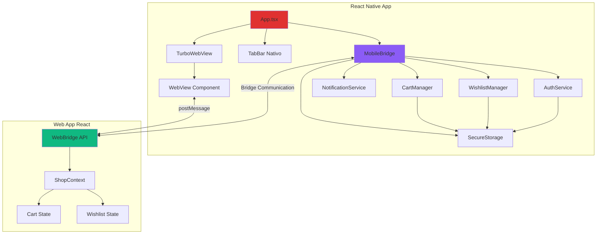
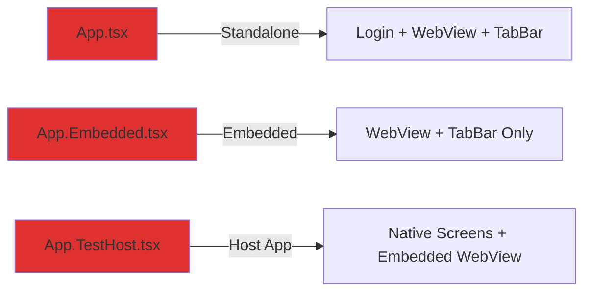
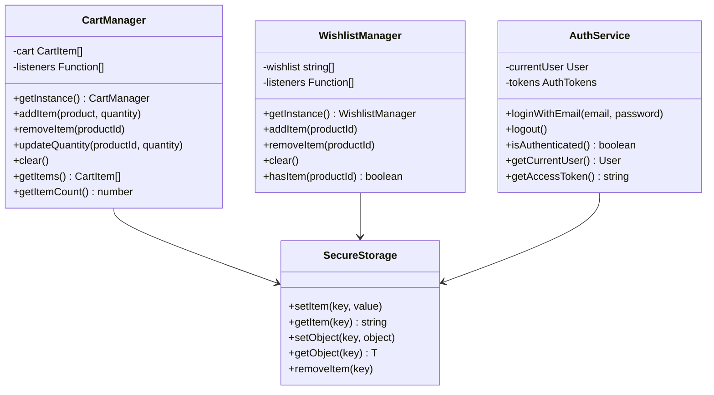
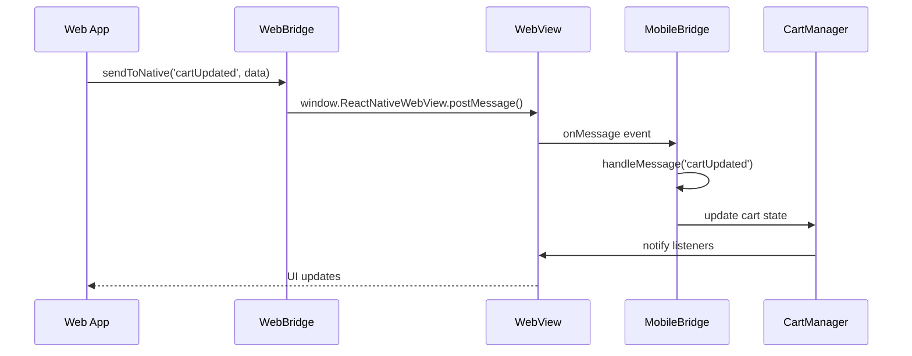
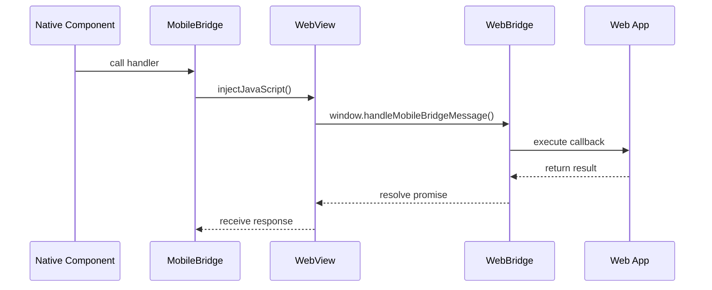
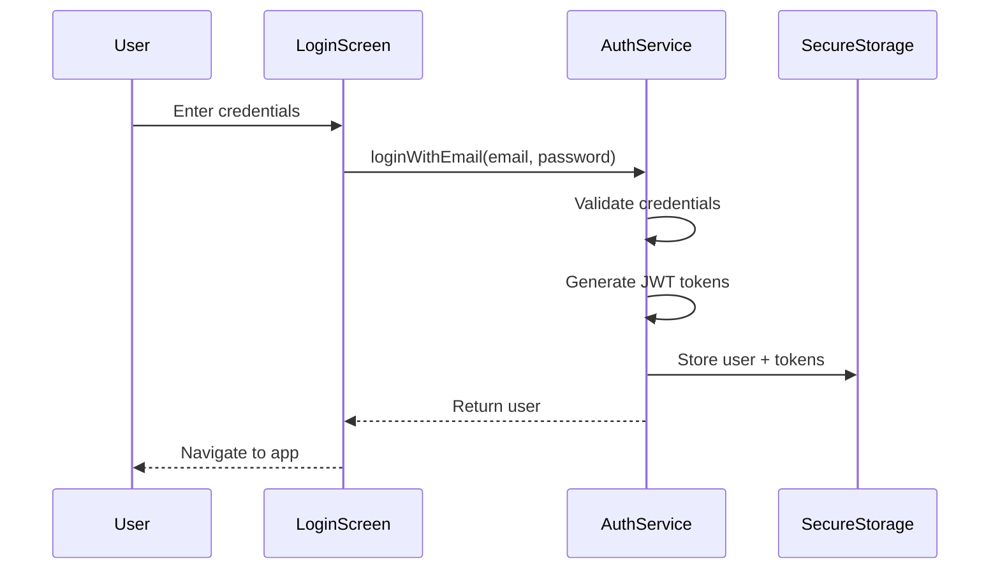

# Arquitetura do Mobile Bridge Template

## Visão Geral

O Mobile Bridge Template é uma arquitetura híbrida que combina aplicações web (React) com aplicações nativas (React Native), permitindo que páginas web se comuniquem bidirecionalmente com funcionalidades nativas do dispositivo.

## Arquitetura do Sistema



## Componentes Principais

### 1. Aplicação Nativa (React Native)

#### App.tsx / App.Embedded.tsx / App.TestHost.tsx
Três modos de operação do aplicativo:

- **App.tsx**: Aplicativo standalone completo com autenticação
- **App.Embedded.tsx**: WebView com TabBar nativo (para embedding)
- **App.TestHost.tsx**: Aplicativo host que demonstra como integrar o embedded



#### Mobile Bridge
Gerencia a comunicação bidirecional entre Web e Native.

**Handlers Registrados:**
```typescript
- navigate: Navegação entre páginas
- addToCart: Adicionar produto ao carrinho
- removeFromCart: Remover produto do carrinho
- updateQuantity: Atualizar quantidade
- clearCart: Limpar carrinho
- addToWishlist: Adicionar aos favoritos
- removeFromWishlist: Remover dos favoritos
- showToast: Exibir notificação toast
- getDeviceInfo: Obter informações do dispositivo
- shareContent: Compartilhar conteúdo
- scanBarcode: Escanear código de barras
- authenticate: Autenticação biométrica
```

#### Managers e Services



### 2. Aplicação Web (React)

#### ShopContext
Gerencia o estado do carrinho e wishlist no lado web, e notifica o nativo sobre mudanças.

```typescript
useEffect(() => {
  const cartCount = cart.reduce((sum, item) => sum + item.quantity, 0);

  if (window.WebBridge) {
    await window.WebBridge.sendToNative('cartUpdated', {
      count: cartCount,
      items: cart.length,
      total: getCartTotal()
    });
  }
}, [cart]);
```

## Fluxo de Comunicação

### Web → Native



### Native → Web



## Estrutura de Pastas

```
MobileBridgeTemplate_RN82/
├── App.tsx                      # Standalone app
├── App.Embedded.tsx             # Embedded WebView with TabBar
├── App.TestHost.tsx             # Host app demo
├── src/
│   ├── bridge/
│   │   └── MobileBridge.ts      # Bridge communication
│   ├── components/
│   │   ├── TabBar.tsx           # Native bottom navigation
│   │   ├── TurboWebView.tsx     # WebView wrapper
│   │   ├── ErrorBoundary.tsx    # Error handling
│   │   ├── NetworkStatusIndicator.tsx
│   │   └── Toast.tsx            # Native toast notifications
│   ├── screens/
│   │   ├── LoginScreen.tsx      # Native login screen
│   │   ├── HomeScreen.tsx       # Native home screen
│   │   ├── ProfileScreen.tsx    # Native profile screen
│   │   └── SettingsScreen.tsx   # Native settings screen
│   ├── services/
│   │   ├── AuthService.ts       # Authentication service
│   │   ├── NotificationService.ts
│   │   ├── PushNotificationService.ts
│   │   ├── AnalyticsService.ts
│   │   └── ErrorLogger.ts
│   ├── storage/
│   │   ├── SecureStorage.ts     # Encrypted storage
│   │   └── OfflineStorage.ts    # Offline data cache
│   ├── store/
│   │   ├── CartManager.ts       # Cart state manager
│   │   └── WishlistManager.ts   # Wishlist manager
│   ├── network/
│   │   └── NetworkManager.ts    # Network connectivity
│   ├── sync/
│   │   └── SyncManager.ts       # Data synchronization
│   └── utils/
│       ├── BridgeSecurity.ts    # Security utilities
│       ├── JWTGenerator.ts      # JWT token generation
│       └── Logger.ts            # Logging utility
├── android/                     # Android native code
└── ios/                         # iOS native code
```

## Padrões de Design

### 1. Singleton Pattern
Usado em CartManager, WishlistManager, e Services para garantir instância única.

```typescript
class CartManager {
  private static instance: CartManager;

  static getInstance(): CartManager {
    if (!CartManager.instance) {
      CartManager.instance = new CartManager();
    }
    return CartManager.instance;
  }
}
```

### 2. Observer Pattern
Managers notificam listeners sobre mudanças de estado.

```typescript
subscribe(listener: (cart: CartItem[]) => void): () => void {
  this.listeners.push(listener);
  return () => {
    this.listeners = this.listeners.filter(l => l !== listener);
  };
}
```

### 3. Promise-based Communication
Toda comunicação bridge é assíncrona com promises.

```typescript
async function sendToNative(type: string, payload: any): Promise<any> {
  return new Promise((resolve, reject) => {
    const messageId = generateId();
    pendingMessages.set(messageId, { resolve, reject });
    window.ReactNativeWebView.postMessage(
      JSON.stringify({ messageId, type, payload })
    );
  });
}
```

## Segurança

### Autenticação JWT


### Armazenamento Seguro
- Tokens JWT armazenados em AsyncStorage criptografado
- Expiração de token: 1 minuto (testing) / 24 horas (production)
- Refresh token: 7 dias
- Logout automático em caso de token expirado

### Validação de Mensagens Bridge
```typescript
// Validação de tipo e payload
if (!message.type || !message.messageId) {
  throw new Error('Invalid message format');
}

// Timeout para evitar promises pendentes infinitas
setTimeout(() => {
  reject(new Error('Message timeout'));
}, 30000);
```

## Performance

### Otimizações Implementadas

1. **TurboWebView**: Cache de WebView para reuso
2. **Lazy Loading**: Componentes carregados sob demanda
3. **Debounce**: Updates de carrinho debounced
4. **Memoization**: useCallback e useMemo em componentes críticos
5. **AsyncStorage**: Persistência de estado offline

### Métricas


## Testes

### Estrutura de Testes
```
__tests__/
├── NetworkManager.test.ts
├── OfflineStorage.test.ts
└── SyncManager.test.ts
```

### Comandos
```bash
npm test              # Run all tests
npm test -- --watch   # Watch mode
npm test -- --coverage # Coverage report
```

## Build e Deploy

### Android
```bash
npm run android:build:debug
npm run android:build:release
```

### iOS
```bash
npm run ios:build:debug
npm run ios:build:release
```

## Troubleshooting

### Problema: Token Expired Errors
**Solução**: AuthService faz logout silencioso quando token expira

### Problema: Cart Counter Reset
**Solução**: WebView é a fonte de verdade, usa `lastValidCartCount` como fallback

### Problema: Bridge Communication Fails
**Solução**: Verifica se `window.WebBridge` está disponível antes de enviar mensagens

## Sugestões de Novas Features

- [ ] Implementar refresh automático de tokens
- [ ] Adicionar suporte a Deep Links
- [ ] Integrar Firebase Analytics
- [ ] Implementar Code Push para updates OTA
- [ ] Adicionar testes E2E com Detox
- [ ] Suporte a modo offline completo
